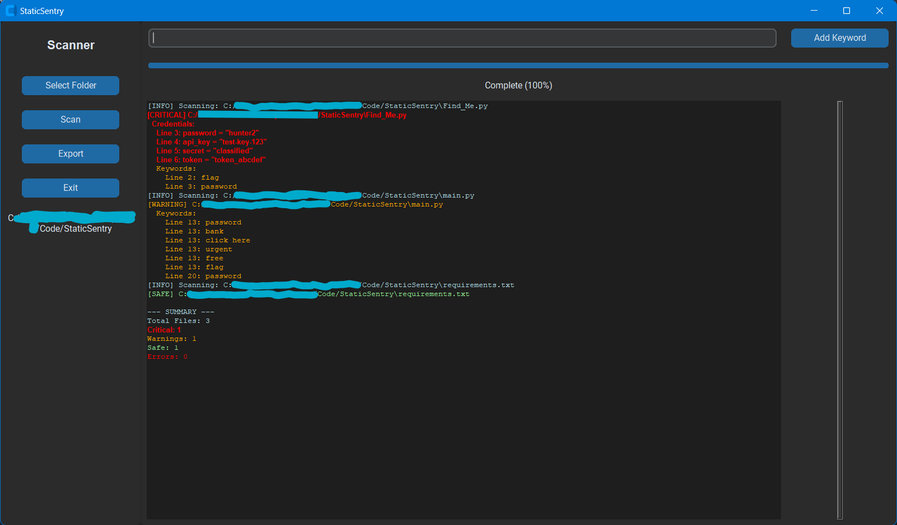

<p align="center">
  
</p>
<h1 align="center"><ins>StaticSentry</ins></h1>


A Python-based cybersecurity scanning tool with a modern GUI built using CustomTkinter.

StaticSentry scans files in a selected directory to detect potentially sensitive or suspicious content using keyword matching and regex-based analysis.

### 🔍 Why StaticSentry?

Hardcoded credentials and sensitive data in source code are a common security risk. StaticSentry helps identify these issues early by scanning files for patterns associated with secrets, reducing the risk of accidental exposure.

#### 💡 Use Cases

- Prevent accidental credential leaks before pushing to GitHub  
- Scan student or personal projects for sensitive data  
- Lightweight security checks for small codebases  

---

## 🚀 Features

🔐 **Regex-Based Secret Detection**

⚠️ _Note: Regex-based detection may produce false positives. Future improvements include entropy-based analysis to improve accuracy._

**Detects credentials such as:**
- Passwords
- API keys
- Tokens
- Secrets

🗝️ **Keyword Detection**
- Flags suspicious terms like:
  - `urgent`, `bank`, `click here`, `free`, `flag`

🧠 **Severity Classification**
- **CRITICAL** → Credentials detected  
- **WARNING** → Suspicious keywords  
- **SAFE** → No issues found  
- **ERROR** → File read issues  

📂 **Structured Output**
- Results grouped by file:
  - Credentials
  - Keywords  
- Line numbers included for precise analysis  

🧹 **Noise Reduction**
- Duplicate findings removed  
- Sorted output for readability  

📊 **Progress Tracking**
- Real-time progress bar during scanning  

🎨 **Modern GUI**
- Built with CustomTkinter  
- Dark mode interface  
- Styled scrollbar and clean layout  

📄 **Export Reports**
- Save scan results to a `.txt` file  

---

## 📄 Example Output

```bash
[CRITICAL] example.py
Line 3: password = "hunter2"
Line 4: api_key = "TEST-KEY-123"

[WARNING] config.txt
Line 10: urgent
Line 12: click here

[SAFE] clean_file.py
```

---

## 🖼️ Preview



---

## 🛠️ Technologies Used

- Python 3.x  
- CustomTkinter  
- Tkinter (Text + Scrollbar styling)  
- Regex (`re` module)  
- OS file traversal (`os.walk`)  

---

## 📦 Requirements

- Python 3.10+
- customtkinter

---

## ⚙️ Installation

1. Clone the repository:
```bash
git clone https://github.com/UnseenUniverse/static-sentry
cd static-sentry
```
2. (Recommended) Create a virtual environment:
```bash
python -m venv .venv
.\.venv\Scripts\activate
```
3. Install dependencies:

Dependencies are listed in `requirements.txt`

4. Run the application:
```bash
python main.py
```

---

## 🚧 Future Improvements

- Add entropy-based secret detection
- Support for additional file types (JSON, YAML)
- Export results as JSON/CSV
- Multithreaded scanning for performance
- Custom rule configuration via GUI

---

## 📜 License

This project is licensed under the MIT License.

---

## 👤 Author

Tony Condon 

GitHub: https://github.com/UnseenUniverse

Website: https://tonycondon.com/